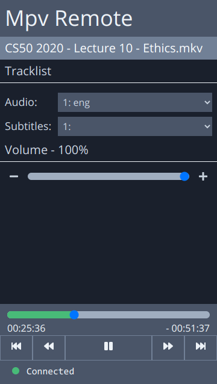

# Mpv Remote

A web app for controlling mpv media player using websockets.

## Screenshot

## Features

- Change audio track
- Change subtitle track
- Seek
- Jump forwards and backwards
- Pause/resume
- Adjust volume

## License

Licensed under the [MIT license](./LICENSE).